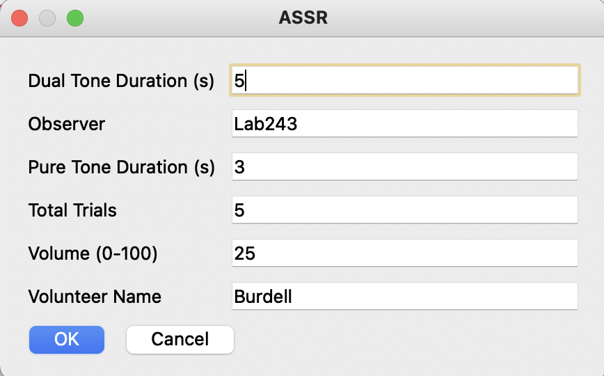

# ASSRStimulus

## Description

This code launches an ASSR experiment in PsychoPy with a GUI to adjust parameters like duration and the number of trials. In case volunteers skip certain trials when they lose focus, the code updates these trial numbers in a separate CSV. See the [experiment design](#experiment-design) section for more details on it. The start and end timestamps of each trial are recorded using an LSL stream in another CSV by ```LSLworker.py```.

## Experiment Design

The initial GUI menu of this experiment looks as follows:



After adjusting the required parameters, the experiment begins. 

Within each trial, the following events happen in order:
1. Pure tone sound is played as a reference for user to memorize
2. Waits for user input to proceed to dual tone sound 
3. Sends LSL Start Marker for the trial
4. Dual tone sound is played for actual data collection (pure tone + random tone mixed)
5. Sends LSL End Marker for the trial
6. Asks the user if they want to skip the previous trial
7. Waits for 3 seconds
8. If yes, records it in a CSV (```volname_date_time.csv```)
8. Continues to next trial

Parallelly, the ```LSLworker.py``` script collects the output stream and parses it to generate another CSV file showing the timestamps and the trial numbers.

## Steps to Run
Run the stimulus and integrate with LSL stream using the steps below.

Ensure you have the following installed on your machine:

1. Python3
2. Pip
3. PsychoPy
4. OpenBCI GUI
5. OpenBCI_LSL-master
6. pydub

If not previously installed, from a clean Ubuntu 20.04 setup, these are the commands to execute in order:

```
sudo apt-get install python3-pip
pip install psychopy
export PATH=/home/ubuntu/.local/bin:$PATH
```

Download the given wheel from [here](https://extras.wxpython.org/wxPython4/extras/linux/gtk3/)
```
pip install Downloads/wxPython-4.1.1-cp38-cp38-linux_x86_64.whl 
sudo apt-get install libusb-1.0-0-dev portaudio19-dev libasound2-dev
pip install psychtoolbox
```

Download Conda from official [website](https://docs.anaconda.com/anaconda/install/index.html) and run:
```
sha256sum Anaconda3-2021.05-Linux-x86_64.sh 
bash Anaconda3-2021.05-Linux-x86_64.sh 
export PATH=/home/ubuntu/anaconda3/bin:$PATH

cd ASSRExp/
conda env create -n psychopy -f psychopy-env.yml
conda activate psychopy
sudo apt-get install libwebkitgtk-1.0.0
```
You might need to exachange the order of above two commands if it does not work on your machine.

```
pip install pydub
psychopy
(After your work, close PsychoPy and deactivate)
conda deactivate
```

More details on installing PsychoPy on Ubuntu and other platforms can be found [here](https://www.psychopy.org/download.html).


Next, download and install OpenBCI_GUI standalone [app](https://openbci.com/downloads) and in its directory, run
```./OpenBCI_GUI ```

Ensure that your dongle is attached, OpenBCI is turned on and the correct port is selected in the GUI. 


Next, clone OpenBCI_LSL-master form [Github](https://github.com/openbci-archive/OpenBCI_LSL)
```
cd OpenBCI_LSL-master/
pip install -r requirements.txt 

(If you get an error, run the command below. After that, remove numpy and scipy from requirements.txt manually and rerun the command above)
python -m pip install --user numpy scipy matplotlib ipython jupyter

```
If not previously done, ensure your path is correct:
```export PATH=/home/ubuntu/.local/bin:$PATH```

Go to OpenBCI_LSL-master/ and run
```python openbci_lsl.py --stream```

If you get any port related errors, specify it manually using:

```
python openbci_lsl.py [PORT] --stream
```


Now, clone this repository and open it on PsychoPy coder's file navigation pane.

Now, start streaming in the OpenBCI GUI, and run ```FinalStimulus.py``` on PsychoPy coder by double clicking it to open and clicking on the green run button.

In another terminal, run:

```
conda activate psychopy
python LSLworker.py
```

## Updates incoming:

~~Full LSL stream integration and saving skipped trials and their timestamps in a CSV.~~ [Done]
